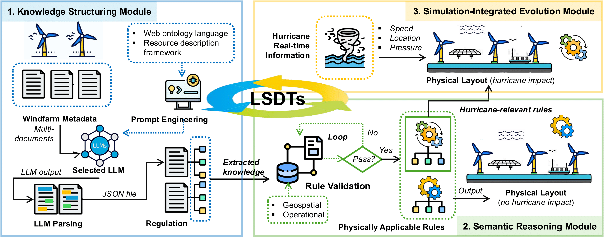
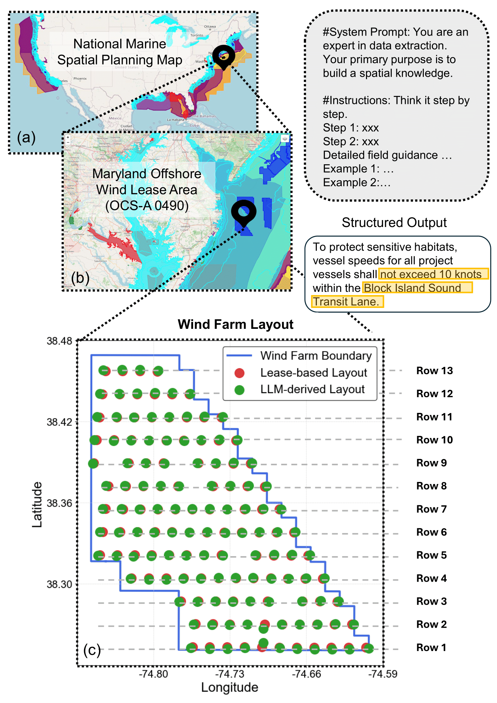
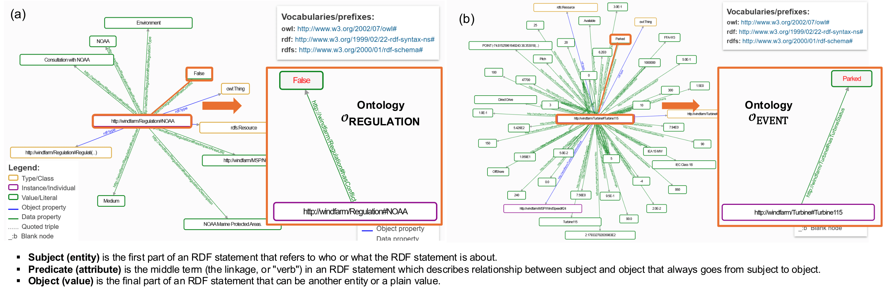
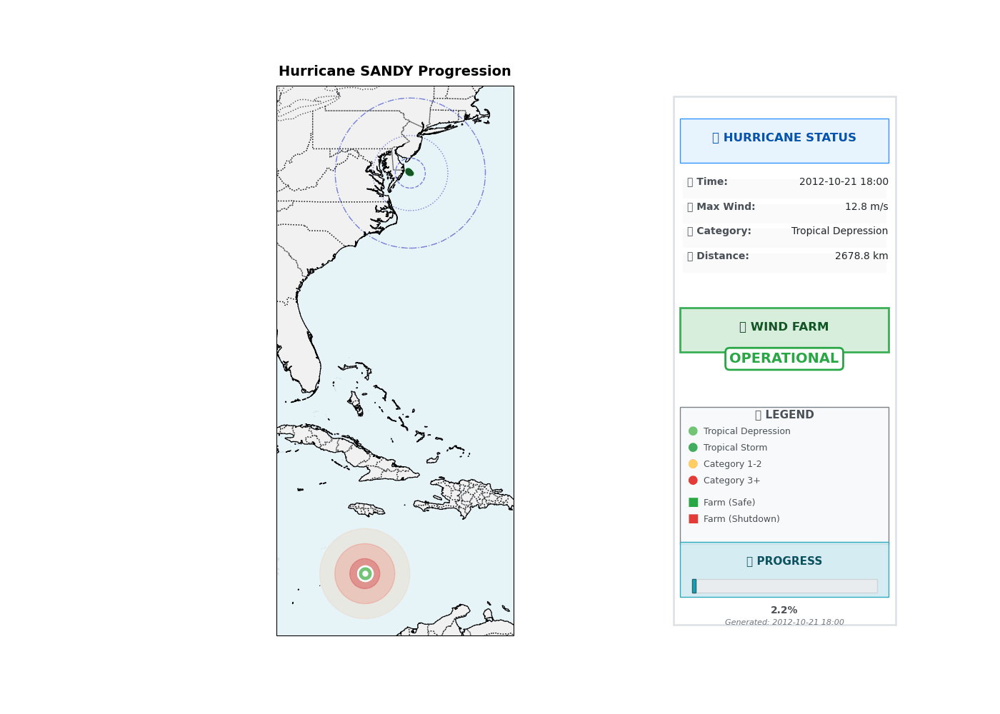
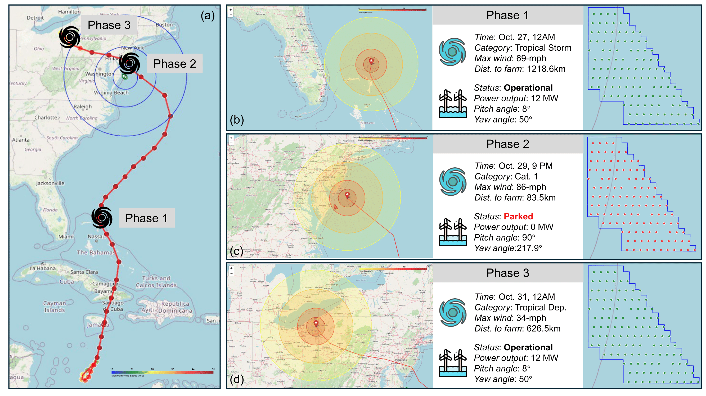

# LSDTs: LLM-Augmented Semantic Digital Twins for Adaptive Knowledge-Intensive Infrastructure Planning

This repository accompanies the source codes for an AAAI paper submission:

**"LSDTs: LLM-Augmented Semantic Digital Twins for Adaptive Knowledge-Intensive Infrastructure Planning."**

---

## 🧠 Overview

Large-scale infrastructure planning is often constrained by a knowledge integration problem: critical regulatory and technical information is fragmented across thousands of unstructured documents. While Digital Twins (DTs) are powerful tools for simulating and optimizing physical systems, they traditionally rely on structured data and struggle with incorporating textual knowledge.

We present **LSDTs (LLM-Augmented Semantic Digital Twins)** — a novel framework that leverages **Large Language Models (LLMs)** and **semantic reasoning** to integrate unstructured planning knowledge into simulation-driven infrastructure design. LSDTs transform documents into a structured RDF knowledge graph, which then powers regulation-aware layout design and dynamic resilience analysis.

Our case study focuses on offshore wind farm planning in Maryland and demonstrates how LSDTs can:

- Automate the ingestion of regulatory and geospatial constraints  
- Guide compliant and optimized turbine layout design  
- Simulate the wind farm’s operational resilience to events like Hurricane Sandy

---

## 🏗️ Architecture

The LSDT framework operates as a closed-loop architecture composed of three synergistic modules connected through a central semantic knowledge graph.

<p align="center">
  
</p>

### 1. Knowledge Structuring Module

This module uses LLMs to extract constraints, attributes, and spatial rules from raw documents and formalizes them as OWL-based RDF triples.

<p align="center">
  
</p>

### 2. Semantic Reasoning Module

Implemented using Apache Jena, this module encodes domain knowledge and constraints using OWL ontologies and SPARQL rules, enabling logical validation of wind turbine layouts.

<p align="center">
  
</p>

### 3. Dynamic Simulation Module

Ingests time-varying data (e.g., hurricane tracks) and simulates infrastructure behavior, supporting resilience assessment and adaptive planning.

<p align="center">
  
</p>

<p align="center">
  
</p>
---

## 📁 Repository Structure

```
.
├── LLM/                           # LLM Knowledge Extraction Module
│   ├── Multi-Model Experiments/
│   │   ├── Anthropic/             # Claude model experiments
│   │   ├── DeepSeek/              # DeepSeek model outputs & experiments
│   │   └── Run_LLM/               # Multi-model batch processing pipeline
│   ├── Document Processing/
│   │   ├── Documents/             # Raw regulatory PDFs
│   │   ├── New_Documents/         # Latest document collection
│   │   ├── New_Documents_json/    # Structured JSON extractions
│   │   └── Preprocessing/         # PDF text extraction & chunking pipeline
│   ├── Output Processing/
│   │   ├── LLM_Results/           # Comparative model analysis results
│   │   ├── New_documents_evaluation/ # Output quality assessment
│   │   └── Extract_regulations/    # Regulatory constraint extraction
│   ├── Quality Control/
│   │   └── Check_doc/             # Document validation & PDF highlighting tools
│   ├── Pipeline Management/
│   │   ├── Prompts/               # LLM prompt templates & strategies
│   │   └── Original/              # Legacy processing scripts
│   └── Screenshots/               # Documentation images
├── Wind/                          # Physical Simulation & Optimization Module
│   ├── Digital_Twin/              # Digital twin implementation
│   │   ├── Coordinates/           # Spatial coordinate management
│   │   └── Response_hurricane/     # Hurricane impact simulation
│   ├── Layout Optimization/
│   │   └── TopFarm/               # Wind farm layout optimization with PyWake
│   ├── Engineering Models/
│   │   └── WEIS/                  # Wind turbine engineering simulation (IEA-15MW)
│   ├── Weather Simulation/
│   │   ├── Hurricane/             # Hurricane modeling & impact analysis
│   │   ├── Nor'easter/            # Northeast storm system simulation
│   │   └── Extreme wind shear and gust/ # Extreme weather event modeling
│   ├── Analysis Tools/
│   │   ├── Surrogate models/      # Machine learning surrogate models
│   │   ├── Rules Extraction/      # Physical constraint rule mining
│   │   └── Utils/                 # Supporting utilities & data processing
├── Wind_Apache_Jena/              # Semantic Reasoning & Knowledge Graph Module
│   ├── Core Architecture/
│   │   ├── Main/                  # System entry points & orchestration
│   │   ├── Ontology/              # Core ontology management framework
│   │   └── Query/                 # SPARQL query engine & templates
│   ├── Knowledge Modeling/
│   │   ├── SemanticModelSpecs/    # OWL ontology specifications
│   │   ├── SemanticModels/        # Turbine, WindFarm, Geospatial ontologies
│   │   └── Builder/               # Ontology construction & data integration
│   ├── Reasoning Engine/
│   │   ├── Rules/                 # SPARQL reasoning rules & constraints
│   │   ├── ExpressionTree/        # Logic expression processing
│   │   └── Listener/              # Event-driven rule processing (Hurricane)
│   ├── Data Processing/
│   │   ├── Geometry/              # Geospatial data handling & WKT processing
│   │   ├── CSVVisitor/            # Tabular data integration patterns
│   │   └── CustomFunctionsArchive/ # Extended SPARQL function library
│   ├── External Integration/
│   │   └── org/apache/jena/       # Apache Jena framework integration
│   └── Utils/                     # Core utility classes & data helpers
├── README.md
└── requirements.txt
```

### Key Components by Module

#### 🤖 LLM Knowledge Extraction Module (`/LLM`)
- **Multi-Model Pipeline**: Comparative experiments with Claude, DeepSeek, and Ollama models
- **Document Processing**: Automated PDF extraction, intelligent chunking, and regulatory content filtering  
- **Prompt Engineering**: Structured prompt templates in [`Prompts`](LLM/Prompts) for consistent extraction
- **Quality Assurance**: Document validation tools in [`Check_doc`](LLM/Check_doc) with PDF highlighting
- **Regulation Mining**: Automated constraint extraction via [`Extract_regulations`](LLM/Extract_regulations)

#### 🌊 Wind Simulation Module (`/Wind`) 
- **Digital Twin**: Real-time wind farm modeling with hurricane response simulation
- **Layout Optimization**: [`TopFarm`](Wind/TopFarm) integration with PyWake for turbine positioning
- **WEIS Integration**: High-fidelity IEA-15MW turbine modeling in [`WEIS`](Wind/WEIS)
- **Weather Modeling**: Comprehensive storm simulation (Hurricane, Nor'easter, extreme wind events)
- **Engineering Analysis**: Physical constraint extraction and surrogate model development

#### 🧠 Semantic Reasoning Module (`/Wind_Apache_Jena`)
- **Ontology Framework**: Comprehensive wind farm ontologies (Turbine, WindFarm, Geospatial)
- **Apache Jena Integration**: Full RDF/OWL reasoning capabilities with custom extensions
- **Rule Engine**: SPARQL-based constraint reasoning and hurricane event processing
- **Knowledge Integration**: Seamless CSV and geospatial data integration via visitor patterns
- **Spatial Reasoning**: Advanced geospatial processing through WKT geometry handling


---

## 📖 Citation

If you use LSDTs in your research, please cite our paper:

```bibtex
@inproceedings{your_citation_key,
  author    = {Anonymous Author(s)},
  title     = {LSDTs: LLM-Augmented Semantic Digital Twins for Adaptive Knowledge-Intensive Infrastructure Planning},
  booktitle = {Proceedings of the AAAI Conference on Artificial Intelligence},
  year      = {2026}
}
```

---

## 🪪 License

This project is licensed under the MIT License. See the [LICENSE](LICENSE) file for details.
